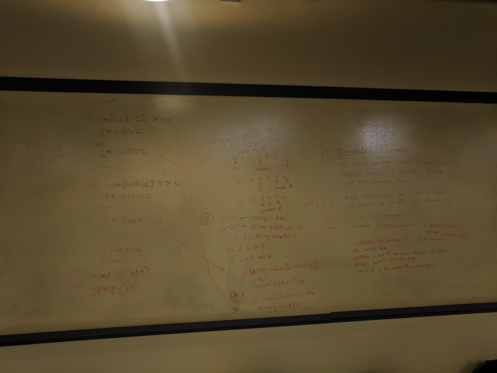

# Binary Search
**Author** : George Ceja
**Version**: 0.2.0

## Overview
A binary search is one of the most efficient ways to search through an array of
ordered numbers.

## Challenge
Checking if the search value is higher or lower.

## Architechture
Python 3.6.4

## Solution
Check if the value is higher or lower than the middle of the array. If higher
then you dump every number from the left by splitting it in half and continue
the process.

## Assets

## Change log
v0.2 - Added binary search test cases & README.md
v0.1 - Created binary search function
