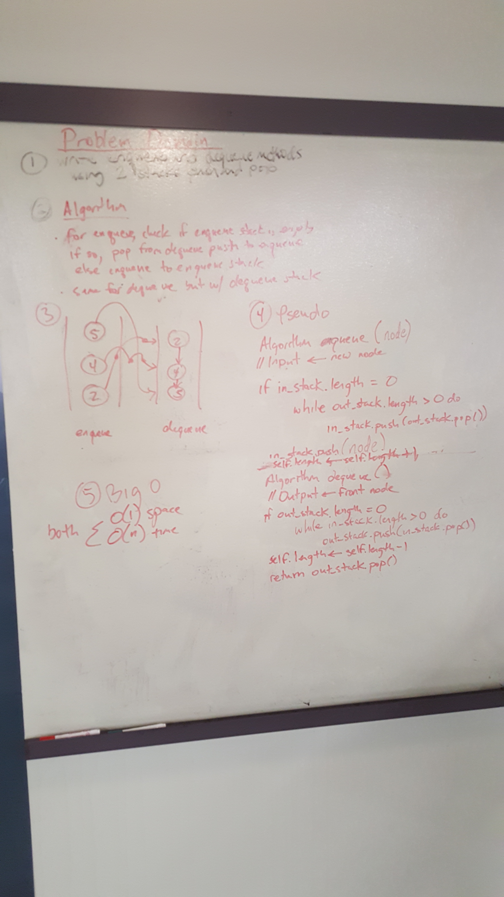

# Queue with stacks
**Author** : George
**Version**: 0.2.0

## Overview
Queue with stacks: Having a stack class use it to build a Queues functionality.
No built-in methods are required. You can use up to 2 Stacks in order to create
Queues methods: Queue & Dequeue.

## Getting Started
---------------
Create 2 methods: Queue & dequeue
using two Stacks

## Assets

## Architecture
Python 3.6.4
Pytest

## API
None
