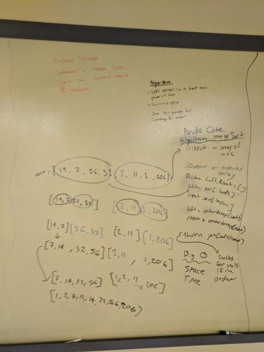

# Merge Sort
Sorts an unordered array using a mergeSort algorithm. Splits an array into half
until no possible then sorts by pairs.

## Challenge
Sorts unordered array.
Edge Cases:
Sorts unordered array with one value
Sorts unordered array with no values

## Solution
[]
